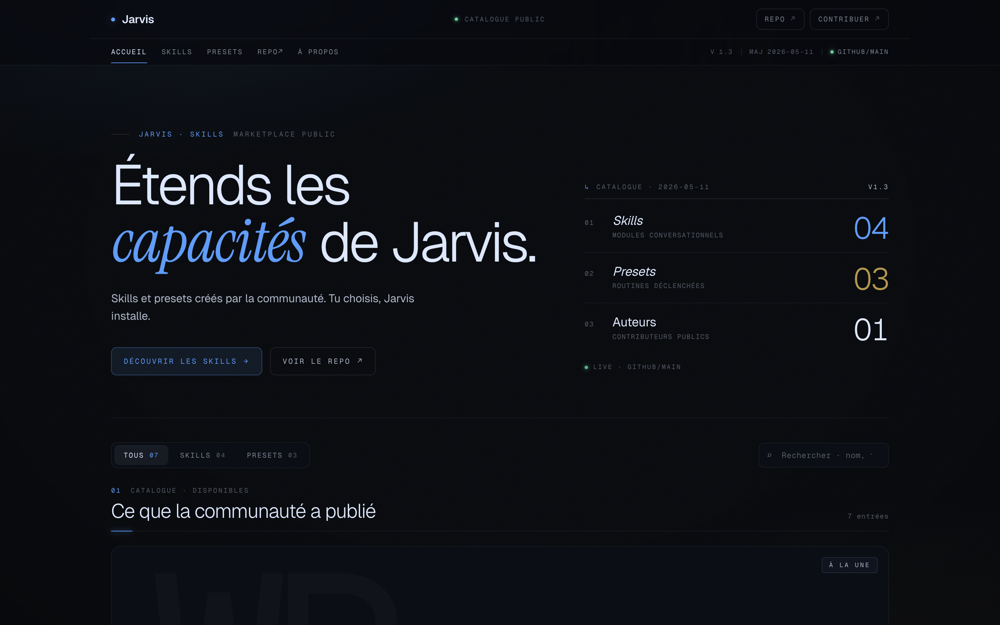

# Jarvis Skills

Catalogue communautaire de skills et presets pour [Jarvis OS](https://github.com/Grominet95/jarvis-OS), l'assistant IA personnel open source.

---

## C'est quoi ?

**Jarvis Skills** est le dépôt public des extensions installables dans Jarvis.

Il y a deux types d'extensions :

### Skills

Un skill injecte un `SYSTEM_PROMPT` spécialisé dans le contexte de Jarvis pour lui donner une nouvelle compétence conversationnelle : recherche web avancée, analyse YouTube, impression 3D, modélisation CAD, etc.

Techniquement : un fichier Python avec un prompt système qui s'active automatiquement quand tu en as besoin.

### Presets

Un preset déclenche une **séquence d'actions concrètes** sur ta machine : ouvrir des apps, activer Ne pas déranger, lancer Spotify, faire parler Jarvis, appeler un LLM. Une phrase suffit à tout lancer.

---

## Installer un skill

Dans Jarvis, ouvre **Paramètres › Marketplace**, recherche le skill et clique **Installer**.

---

## Catalogue

### Skills conversationnels

| Skill | Description | Outils requis | Variables d'env |
|-------|-------------|---------------|-----------------|
| [web-researcher](skills/web-researcher/) | Recherche web avancée avec synthèse et citations | browser | |
| [youtube-analyzer](skills/youtube-analyzer/) | Analyse de performances YouTube et suggestions de contenu | | `YOUTUBE_API_KEY`, `YOUTUBE_CHANNEL_ID` |
| [bambulab-printer](skills/bambulab-printer/) | Contrôle d'imprimante BambuLab via MQTT | | `PRINTER_IP`, `PRINTER_SERIAL`, `PRINTER_ACCESS_CODE` |
| [fusion360](skills/fusion360/) | Pilote Fusion 360 via MCP : scripts Python API, export STL | | |

### Presets

| Preset | Description | Plateformes |
|--------|-------------|-------------|
| [mode-streameur](skills/mode-streameur/) | Lance OBS, Twitch, Ne pas déranger et recommande un jeu | mac, windows |
| [mode-travail](skills/mode-travail/) | Ouvre Notion, VS Code et active le mode focus | mac, windows |
| [mode-nuit](skills/mode-nuit/) | Ferme les apps de travail, lance une playlist et fait le bilan de journée | mac, windows |

---

## Contribuer

Tu veux ajouter une capacité à Jarvis et la partager avec la communauté ?
Lis [CONTRIBUTING.md](CONTRIBUTING.md), le process est rapide.

---

## Communauté

